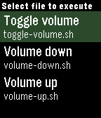
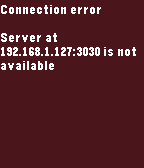
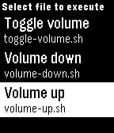

# Exec File

A pebble app that allows you to execute remote files from your pebble. The app 
needs a companion app, server, to be running on your local network and to be
accessible via HTTP.

The number of files that you can execute is not limited, and you also get 
visual feedback in form of message. The message contains whatever was written 
to **stdout** or **stderr**.

When adding new script, you don't need to change the pebble app or server in 
any way, just add a new executable to **scripts/** directory of the server and 
the file will appear in menu when you restart the pebble app.

You can run the server on your laptop, Raspberry Pi or whatever. You can also 
write you own server. Read more [here](server/README.md) about how to setup the 
server and what API should be provided in order to work with Exec File pebble 
app.

## Screenshots

